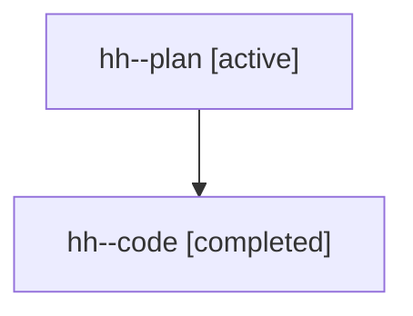

# Family: hh

Owner: `bbugyi200.athena` · Hood: `hh` · Members: 2

## Lineage

The diagram is an optional enhancement; the ordered table below contains the same lineage in accessible text.

| Role | Agent | State | Model / provider | Timing | Commits | Prompt | Chat |
|---|---|---|---|---|---:|---|---|
| plan | hh--plan | active | gpt-5.6-sol / codex | 2026-07-21T20:09:12.888861+00:00 | 0 | [Prompt](../agents/bbugyi200.athena.hh--plan/prompt.md) | [Chat](../agents/bbugyi200.athena.hh--plan/chat.md) |
| code | hh--code | completed | gpt-5.6-sol / codex | 2026-07-21T20:14:21.456327+00:00 | 1 | — | [Chat](../agents/bbugyi200.athena.hh--code/chat.md) |
