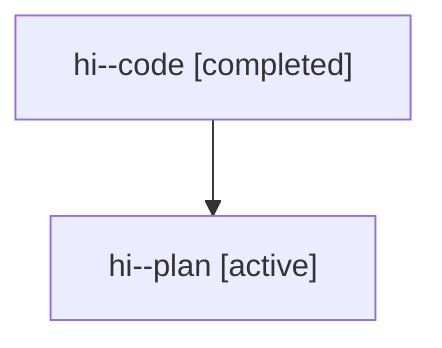

# Family: hi

[Agent Hoods](../README.md) / [bbugyi200](../users/bbugyi200/README.md) / [athena](../users/bbugyi200/machines/athena/README.md) / [hi](../users/bbugyi200/machines/athena/hoods/hi/README.md) / hi

Owner: `bbugyi200.athena` · Hood: `hi` · Members: 2

## Lineage

The diagram is an optional enhancement; the ordered table below contains the same lineage in accessible text.

| Role | Agent | State | Model / provider | Timing | Commits | Prompt | Chat |
|---|---|---|---|---|---:|---|---|
| code | hi--code | completed | gpt-5.6-sol / codex | 2026-07-21T20:23:57.430334+00:00 | [1](../agents/bbugyi200.athena.hi--code/README.md#commits) | — | [Chat](../agents/bbugyi200.athena.hi--code/chat.md) |
| plan | hi--plan | active | gpt-5.6-sol / codex | 2026-07-21T20:15:33.189095+00:00 | 0 | [Prompt](../agents/bbugyi200.athena.hi--plan/prompt.md) | [Chat](../agents/bbugyi200.athena.hi--plan/chat.md) |

## Commits

| Role | Repo | Commit | Subject | Committed (UTC) |
|---|---|---|---|---|
| code | sase | [`6307a3f`](https://github.com/sase-org/sase/commit/6307a3fc3bc4b4b832ce8152e44fa70d2e382e25) | fix: suppress completion bell during handoffs | 2026-07-21 20:38:35 |
