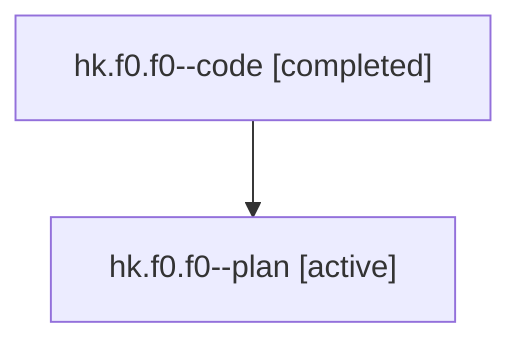

# Family: hk.f0.f0

[Agent Hoods](../README.md) / [bbugyi200](../users/bbugyi200/README.md) / [athena](../users/bbugyi200/machines/athena/README.md) / [hk](../users/bbugyi200/machines/athena/hoods/hk/README.md) / hk.f0.f0

Owner: `bbugyi200.athena` · Hood: `hk` · Members: 2

## Lineage

The diagram is an optional enhancement; the ordered table below contains the same lineage in accessible text.

| Role | Agent | State | Model / provider | Timing | Commits | Prompt | Chat |
|---|---|---|---|---|---:|---|---|
| code | hk.f0.f0--code | completed | gpt-5.6-sol / codex | 2026-07-22T11:27:48.247840+00:00 | 0 | — | [Chat](../agents/bbugyi200.athena.hk.f0.f0--code/chat.md) |
| plan | hk.f0.f0--plan | active | gpt-5.6-sol / codex | 2026-07-22T11:19:23.217095+00:00 | 0 | [Prompt](../agents/bbugyi200.athena.hk.f0.f0--plan/prompt.md) | [Chat](../agents/bbugyi200.athena.hk.f0.f0--plan/chat.md) |

## Commits

| Role | Repo | Commit | Subject | Committed |
|---|---|---|---|---|
| — | sase | [`1da3817`](https://github.com/sase-org/sase/commit/1da3817eb72f994709f2d4147277134e3c36c73b) | fix(ace): collapse houses before agent groups | 2026-07-22 08:03:17 EDT |

## Neighbors

| Agent | Relation | State |
|---|---|---|
| [hk.f0](bbugyi200.athena.hk.f0.md) (family · 2) | ancestor | active 1, completed 1 |
| [hk](../agents/bbugyi200.athena.hk/README.md) | ancestor | active |
