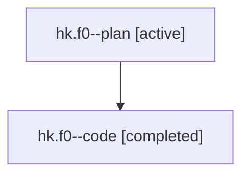

# Family: hk.f0

[Agent Hoods](../README.md) / [bbugyi200](../users/bbugyi200/README.md) / [athena](../users/bbugyi200/machines/athena/README.md) / [hk](../users/bbugyi200/machines/athena/hoods/hk/README.md) / hk.f0

Owner: `bbugyi200.athena` · Hood: `hk` · Members: 2

## Lineage

The diagram is an optional enhancement; the ordered table below contains the same lineage in accessible text.

| Role | Agent | State | Model / provider | Timing | Commits | Prompt | Chat |
|---|---|---|---|---|---:|---|---|
| plan | hk.f0--plan | active | gpt-5.6-sol / codex | 2026-07-22T10:23:13.362616+00:00 | 0 | [Prompt](../agents/bbugyi200.athena.hk.f0--plan/prompt.md) | [Chat](../agents/bbugyi200.athena.hk.f0--plan/chat.md) |
| code | hk.f0--code | completed | gpt-5.6-sol / codex | 2026-07-22T10:31:06.694146+00:00 | [1](../agents/bbugyi200.athena.hk.f0--code/README.md#commits) | — | [Chat](../agents/bbugyi200.athena.hk.f0--code/chat.md) |

## Commits

| Role | Commit | Subject | Committed (UTC) |
|---|---|---|---|
| code | [`fe8c2e0`](https://github.com/sase-org/sase/commit/fe8c2e0277e5cd77cce6d591f135407924c0385b) | fix(ace): navigate to all agent house parents | 2026-07-22 11:03:11 |

## Neighbors

| Agent | Relation | State |
|---|---|---|
| [hk](../agents/bbugyi200.athena.hk/README.md) | ancestor | active |
| [hk.f0.f0](bbugyi200.athena.hk.f0.f0.md) (family · 2) | descendant | active 1, completed 1 |
| [hk.f0.f0](../agents/bbugyi200.athena.hk.f0.f0/README.md) | descendant | completed |
