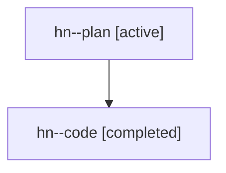

# Family: hn

[Agent Hoods](../README.md) / [bbugyi200](../users/bbugyi200/README.md) / [athena](../users/bbugyi200/machines/athena/README.md) / [hn](../users/bbugyi200/machines/athena/hoods/hn/README.md) / hn

Owner: `bbugyi200.athena` · Hood: `hn` · Members: 2

## Lineage

The diagram is an optional enhancement; the ordered table below contains the same lineage in accessible text.

| Role | Agent | State | Model / provider | Timing | Commits | Prompt | Chat |
|---|---|---|---|---|---:|---|---|
| plan | hn--plan | active | gpt-5.6-sol / codex | 2026-07-22T10:17:26.479107+00:00 | 0 | [Prompt](../agents/bbugyi200.athena.hn--plan/prompt.md) | [Chat](../agents/bbugyi200.athena.hn--plan/chat.md) |
| code | hn--code | completed | gpt-5.6-sol / codex | 2026-07-22T10:26:34.536197+00:00 | [1](../agents/bbugyi200.athena.hn--code/README.md#commits) | — | [Chat](../agents/bbugyi200.athena.hn--code/chat.md) |

## Commits

| Role | Repo | Commit | Subject | Committed |
|---|---|---|---|---|
| code | sase | [`2b875db`](https://github.com/sase-org/sase/commit/2b875dbcc6a5ad959f9da4a1fdd010ca328a2e9d) | feat(statistics): add configurable half-page scrolling | 2026-07-22 11:18:58 UTC |
