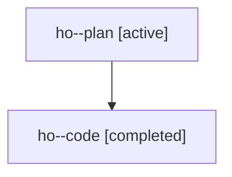

# Family: ho

[Agent Hoods](../README.md) / [bbugyi200](../users/bbugyi200/README.md) / [athena](../users/bbugyi200/machines/athena/README.md) / [ho](../users/bbugyi200/machines/athena/hoods/ho/README.md) / ho

Owner: `bbugyi200.athena` · Hood: `ho` · Members: 2

## Lineage

The diagram is an optional enhancement; the ordered table below contains the same lineage in accessible text.

| Role | Agent | State | Model / provider | Timing | Commits | Prompt | Chat |
|---|---|---|---|---|---:|---|---|
| plan | ho--plan | active | gpt-5.6-sol / codex | 2026-07-22T10:31:49.969939+00:00 | 0 | [Prompt](../agents/bbugyi200.athena.ho--plan/prompt.md) | [Chat](../agents/bbugyi200.athena.ho--plan/chat.md) |
| code | ho--code | completed | gpt-5.6-sol / codex | 2026-07-22T10:41:36.709441+00:00 | 0 | — | [Chat](../agents/bbugyi200.athena.ho--code/chat.md) |

## Commits

| Role | Repo | Commit | Subject | Committed |
|---|---|---|---|---|
| — | sase | [`9f11060`](https://github.com/sase-org/sase/commit/9f1106068caa951039966938424ade137a01e5a0) | fix(ace): reconcile cross-surface plan approval status | 2026-07-22 11:21:38 UTC |
