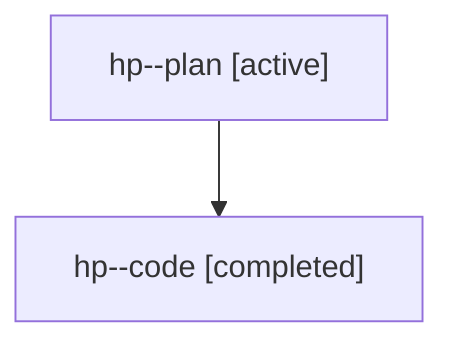

# Family: hp

Owner: `bbugyi200.athena` · Hood: `hp` · Members: 2

## Lineage

The diagram is an optional enhancement; the ordered table below contains the same lineage in accessible text.

| Role | Agent | State | Model / provider | Timing | Commits | Prompt | Chat |
|---|---|---|---|---|---:|---|---|
| plan | hp--plan | active | gpt-5.6-sol / codex | 2026-07-22T10:42:51.450556+00:00 | 0 | [Prompt](../agents/bbugyi200.athena.hp--plan/prompt.md) | [Chat](../agents/bbugyi200.athena.hp--plan/chat.md) |
| code | hp--code | completed | gpt-5.6-sol / codex | 2026-07-22T10:50:52.460371+00:00 | 1 | — | [Chat](../agents/bbugyi200.athena.hp--code/chat.md) |
