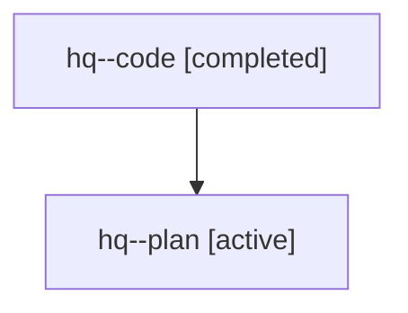

# Family: hq

[Agent Hoods](../README.md) / [bbugyi200](../users/bbugyi200/README.md) / [athena](../users/bbugyi200/machines/athena/README.md) / [hq](../users/bbugyi200/machines/athena/hoods/hq/README.md) / hq

Owner: `bbugyi200.athena` · Hood: `hq` · Members: 2

## Lineage

The diagram is an optional enhancement; the ordered table below contains the same lineage in accessible text.

| Role | Agent | State | Model / provider | Timing | Commits | Prompt | Chat |
|---|---|---|---|---|---:|---|---|
| code | hq--code | completed | gpt-5.6-sol / codex | 2026-07-22T10:57:44.468083+00:00 | 0 | — | [Chat](../agents/bbugyi200.athena.hq--code/chat.md) |
| plan | hq--plan | active | gpt-5.6-sol / codex | 2026-07-22T10:52:56.509082+00:00 | 0 | [Prompt](../agents/bbugyi200.athena.hq--plan/prompt.md) | [Chat](../agents/bbugyi200.athena.hq--plan/chat.md) |

## Neighbors

| Agent | Relation | State |
|---|---|---|
| [hq.f0](../agents/bbugyi200.athena.hq.f0/README.md) | descendant | active |
| [hq.f2](bbugyi200.athena.hq.f2.md) (family · 2) | descendant | active 1, completed 1 |
| [hq.f2](../agents/bbugyi200.athena.hq.f2/README.md) | descendant | completed |
| [hq.f2.f0](../agents/bbugyi200.athena.hq.f2.f0/README.md) | descendant | active |
| [hq.f2.f1](bbugyi200.athena.hq.f2.f1.md) (family · 2) | descendant | active 1, completed 1 |
| [hq.f2.f1](../agents/bbugyi200.athena.hq.f2.f1/README.md) | descendant | completed |
