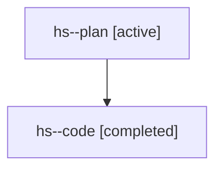

# Family: hs

[Agent Hoods](../README.md) / [bbugyi200](../users/bbugyi200/README.md) / [athena](../users/bbugyi200/machines/athena/README.md) / [hs](../users/bbugyi200/machines/athena/hoods/hs/README.md) / hs

Owner: `bbugyi200.athena` · Hood: `hs` · Members: 2

## Lineage

The diagram is an optional enhancement; the ordered table below contains the same lineage in accessible text.

| Role | Agent | State | Model / provider | Timing | Commits | Prompt | Chat |
|---|---|---|---|---|---:|---|---|
| plan | hs--plan | active | gpt-5.6-sol / codex | 2026-07-22T10:59:47.631202+00:00 | 0 | [Prompt](../agents/bbugyi200.athena.hs--plan/prompt.md) | [Chat](../agents/bbugyi200.athena.hs--plan/chat.md) |
| code | hs--code | completed | gpt-5.6-sol / codex | 2026-07-22T11:12:35.291505+00:00 | 0 | — | [Chat](../agents/bbugyi200.athena.hs--code/chat.md) |

## Commits

| Role | Repo | Commit | Subject | Committed |
|---|---|---|---|---|
| — | sase | [`1aa37dc`](https://github.com/sase-org/sase/commit/1aa37dc35d9ad2bd5c165c118363b45db0b0a21c) | feat: add runner limit controls | 2026-07-22 12:30:17 UTC |
