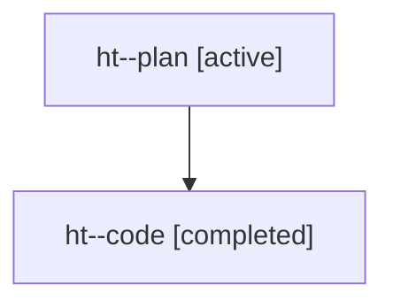

# Family: ht

[Agent Hoods](../README.md) / [bbugyi200](../users/bbugyi200/README.md) / [athena](../users/bbugyi200/machines/athena/README.md) / [ht](../users/bbugyi200/machines/athena/hoods/ht/README.md) / ht

Owner: `bbugyi200.athena` · Hood: `ht` · Members: 2

## Lineage

The diagram is an optional enhancement; the ordered table below contains the same lineage in accessible text.

| Role | Agent | State | Model / provider | Timing | Commits | Prompt | Chat |
|---|---|---|---|---|---:|---|---|
| plan | ht--plan | active | gpt-5.6-sol / codex | 2026-07-22T11:05:33.022996+00:00 | 0 | [Prompt](../agents/bbugyi200.athena.ht--plan/prompt.md) | [Chat](../agents/bbugyi200.athena.ht--plan/chat.md) |
| code | ht--code | completed | gpt-5.6-sol / codex | 2026-07-22T11:20:53.122392+00:00 | [1](../agents/bbugyi200.athena.ht--code/README.md#commits) | — | [Chat](../agents/bbugyi200.athena.ht--code/chat.md) |

## Commits

| Role | Repo | Commit | Subject | Committed |
|---|---|---|---|---|
| code | sase | [`5839250`](https://github.com/sase-org/sase/commit/58392509657b46b69db09190290438e8b50bdab0) | feat(ace): highlight TODO annotations in prompts | 2026-07-22 12:07:11 UTC |
