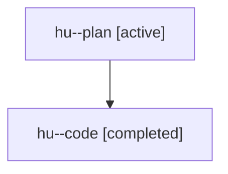

# Family: hu

[Agent Hoods](../README.md) / [bbugyi200](../users/bbugyi200/README.md) / [athena](../users/bbugyi200/machines/athena/README.md) / [hu](../users/bbugyi200/machines/athena/hoods/hu/README.md) / hu

Owner: `bbugyi200.athena` · Hood: `hu` · Members: 2

## Lineage

The diagram is an optional enhancement; the ordered table below contains the same lineage in accessible text.

| Role | Agent | State | Model / provider | Timing | Commits | Prompt | Chat |
|---|---|---|---|---|---:|---|---|
| plan | hu--plan | active | gpt-5.6-sol / codex | 2026-07-22T11:15:36.277919+00:00 | 0 | [Prompt](../agents/bbugyi200.athena.hu--plan/prompt.md) | [Chat](../agents/bbugyi200.athena.hu--plan/chat.md) |
| code | hu--code | completed | gpt-5.6-sol / codex | 2026-07-22T11:20:43.868768+00:00 | [1](../agents/bbugyi200.athena.hu--code/README.md#commits) | — | [Chat](../agents/bbugyi200.athena.hu--code/chat.md) |

## Commits

| Role | Repo | Commit | Subject | Committed |
|---|---|---|---|---|
| code | sase | [`cba6525`](https://github.com/sase-org/sase/commit/cba65253b1f0bd5414755120f5f0a2f198d2d7e4) | fix(ace): keep ungrouped agent houses first | 2026-07-22 11:33:36 UTC |
