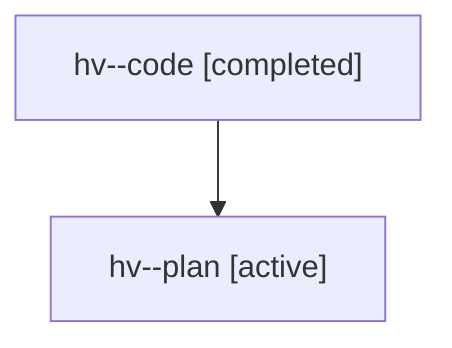

# Family: hv

[Agent Hoods](../README.md) / [bbugyi200](../users/bbugyi200/README.md) / [athena](../users/bbugyi200/machines/athena/README.md) / [hv](../users/bbugyi200/machines/athena/hoods/hv/README.md) / hv

Owner: `bbugyi200.athena` · Hood: `hv` · Members: 2

## Lineage

The diagram is an optional enhancement; the ordered table below contains the same lineage in accessible text.

| Role | Agent | State | Model / provider | Timing | Commits | Prompt | Chat |
|---|---|---|---|---|---:|---|---|
| code | hv--code | completed | gpt-5.6-sol / codex | 2026-07-22T11:44:56.689019+00:00 | [1](../agents/bbugyi200.athena.hv--code/README.md#commits) | — | [Chat](../agents/bbugyi200.athena.hv--code/chat.md) |
| plan | hv--plan | active | gpt-5.6-sol / codex | 2026-07-22T11:39:44.392019+00:00 | 0 | [Prompt](../agents/bbugyi200.athena.hv--plan/prompt.md) | [Chat](../agents/bbugyi200.athena.hv--plan/chat.md) |

## Commits

| Role | Repo | Commit | Subject | Committed |
|---|---|---|---|---|
| code | sase | [`12166f1`](https://github.com/sase-org/sase/commit/12166f196a7affd4f36cd3cf863e2295f3f90a76) | feat(statistics): add contextual project keymaps | 2026-07-22 12:25:02 UTC |
