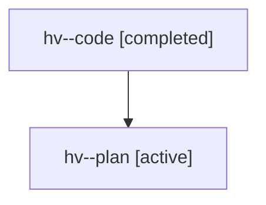

# Family: hv

Owner: `bbugyi200.athena` · Hood: `hv` · Members: 2

## Lineage

The diagram is an optional enhancement; the ordered table below contains the same lineage in accessible text.

| Role | Agent | State | Model / provider | Timing | Commits | Prompt | Chat |
|---|---|---|---|---|---:|---|---|
| code | hv--code | completed | gpt-5.6-sol / codex | 2026-07-22T11:44:56.689019+00:00 | 1 | — | [Chat](../agents/bbugyi200.athena.hv--code/chat.md) |
| plan | hv--plan | active | gpt-5.6-sol / codex | 2026-07-22T11:39:44.392019+00:00 | 0 | [Prompt](../agents/bbugyi200.athena.hv--plan/prompt.md) | [Chat](../agents/bbugyi200.athena.hv--plan/chat.md) |
