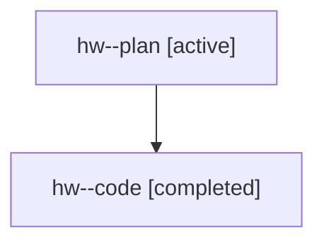

# Family: hw

[Agent Hoods](../README.md) / [bbugyi200](../users/bbugyi200/README.md) / [athena](../users/bbugyi200/machines/athena/README.md) / [hw](../users/bbugyi200/machines/athena/hoods/hw/README.md) / hw

Owner: `bbugyi200.athena` · Hood: `hw` · Members: 2

## Lineage

The diagram is an optional enhancement; the ordered table below contains the same lineage in accessible text.

| Role | Agent | State | Model / provider | Timing | Commits | Prompt | Chat |
|---|---|---|---|---|---:|---|---|
| plan | hw--plan | active | gpt-5.6-sol / codex | 2026-07-22T11:44:12.583957+00:00 | 0 | [Prompt](../agents/bbugyi200.athena.hw--plan/prompt.md) | [Chat](../agents/bbugyi200.athena.hw--plan/chat.md) |
| code | hw--code | completed | gpt-5.6-sol / codex | 2026-07-22T11:51:11.725321+00:00 | [1](../agents/bbugyi200.athena.hw--code/README.md#commits) | — | [Chat](../agents/bbugyi200.athena.hw--code/chat.md) |

## Commits

| Role | Repo | Commit | Subject | Committed |
|---|---|---|---|---|
| code | sase | [`ea575c7`](https://github.com/sase-org/sase/commit/ea575c7c1f366d3a2b8d0885c987bcb5c710935b) | fix(config): wrap j and k tree navigation | 2026-07-22 12:04:05 UTC |
