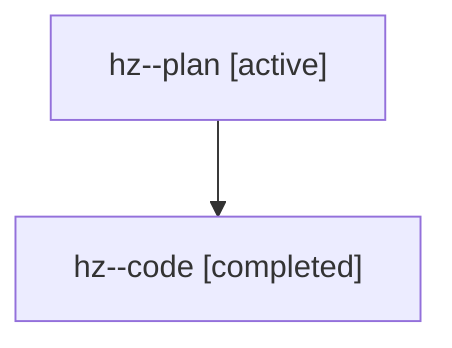

# Family: hz

[Agent Hoods](../README.md) / [bbugyi200](../users/bbugyi200/README.md) / [athena](../users/bbugyi200/machines/athena/README.md) / [hz](../users/bbugyi200/machines/athena/hoods/hz/README.md) / hz

Owner: `bbugyi200.athena` · Hood: `hz` · Members: 2

## Lineage

The diagram is an optional enhancement; the ordered table below contains the same lineage in accessible text.

| Role | Agent | State | Model / provider | Timing | Commits | Prompt | Chat |
|---|---|---|---|---|---:|---|---|
| plan | hz--plan | active | opus / claude | 2026-07-22T12:25:43.486489+00:00 | 0 | [Prompt](../agents/bbugyi200.athena.hz--plan/prompt.md) | [Chat](../agents/bbugyi200.athena.hz--plan/chat.md) |
| code | hz--code | completed | gpt-5.6-sol / codex | 2026-07-22T12:33:27.238466+00:00 | [1](../agents/bbugyi200.athena.hz--code/README.md#commits) | — | [Chat](../agents/bbugyi200.athena.hz--code/chat.md) |

## Commits

| Role | Commit | Subject | Committed (UTC) |
|---|---|---|---|
| code | [`ac9fb40`](https://github.com/sase-org/sase/commit/ac9fb4081c92e903639142c6d03c52a303c20375) | fix(tui): soften TODO annotation styling | 2026-07-22 12:55:44 |
