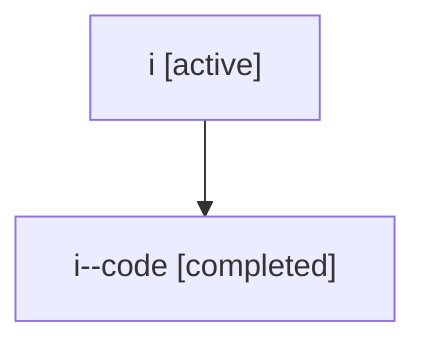

# Family: i

[Agent Hoods](../README.md) / [bbugyi200](../users/bbugyi200/README.md) / [athena](../users/bbugyi200/machines/athena/README.md) / [i](../users/bbugyi200/machines/athena/hoods/i/README.md) / i

Owner: `bbugyi200.athena` · Hood: `i` · Members: 2

## Lineage

The diagram is an optional enhancement; the ordered table below contains the same lineage in accessible text.

| Role | Agent | State | Model / provider | Timing | Commits | Prompt | Chat |
|---|---|---|---|---|---:|---|---|
| root | i | active | claude-fable-5 / claude | 2026-07-06T18:21:15.037744+00:00 | [2](../agents/bbugyi200.athena.i/README.md#commits) | [Prompt](../agents/bbugyi200.athena.i/prompt.md) | [Chat](../agents/bbugyi200.athena.i/chat.md) |
| code | i--code | completed | gpt-5.5 / codex | 2026-07-06T18:32:38.036521+00:00 | 0 | — | [Chat](../agents/bbugyi200.athena.i--code/chat.md) |

## Commits

| Role | Commit | Subject | Committed (UTC) |
|---|---|---|---|
| root | [`3fbd33d`](https://github.com/sase-org/sase/commit/3fbd33dd07d55f215536c0b3a33b8ff8aa50cf39) | chore: Add SDD prompt and plan for sase\_ace\_demo\_video | 2026-07-06 18:32:36 |
| root | [`751145d`](https://github.com/sase-org/sase/commit/751145d581111765134f64b9b6c40ecc2688685b) | feat(demos): add ACE prompt input demo video | 2026-07-06 19:41:18 |

## Neighbors

| Agent | Relation | State |
|---|---|---|
| [i.f1](../agents/bbugyi200.athena.i.f1/README.md) | descendant | active |
