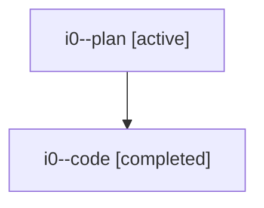

# Family: i0

[Agent Hoods](../README.md) / [bbugyi200](../users/bbugyi200/README.md) / [athena](../users/bbugyi200/machines/athena/README.md) / [i0](../users/bbugyi200/machines/athena/hoods/i0/README.md) / i0

Owner: `bbugyi200.athena` · Hood: `i0` · Members: 2

## Lineage

The diagram is an optional enhancement; the ordered table below contains the same lineage in accessible text.

| Role | Agent | State | Model / provider | Timing | Commits | Prompt | Chat |
|---|---|---|---|---|---:|---|---|
| plan | i0--plan | active | gpt-5.6-sol / codex | 2026-07-22T12:29:38.620735+00:00 | 0 | [Prompt](../agents/bbugyi200.athena.i0--plan/prompt.md) | [Chat](../agents/bbugyi200.athena.i0--plan/chat.md) |
| code | i0--code | completed | gpt-5.6-sol / codex | 2026-07-22T12:36:23.723023+00:00 | [1](../agents/bbugyi200.athena.i0--code/README.md#commits) | — | [Chat](../agents/bbugyi200.athena.i0--code/chat.md) |

## Commits

| Role | Repo | Commit | Subject | Committed |
|---|---|---|---|---|
| code | sase | [`678414a`](https://github.com/sase-org/sase/commit/678414a6ce10e728fe4d9a32cae741752a87094f) | feat(ace): jump from collapsed panels to expanded panel | 2026-07-22 13:19:36 UTC |
