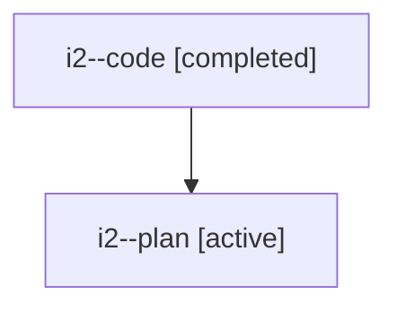

# Family: i2

Owner: `bbugyi200.athena` · Hood: `i2` · Members: 2

## Lineage

The diagram is an optional enhancement; the ordered table below contains the same lineage in accessible text.

| Role | Agent | State | Model / provider | Timing | Commits | Prompt | Chat |
|---|---|---|---|---|---:|---|---|
| code | i2--code | completed | gpt-5.6-sol / codex | 2026-07-22T13:18:19.138177+00:00 | 1 | — | [Chat](../agents/bbugyi200.athena.i2--code/chat.md) |
| plan | i2--plan | active | opus / claude | 2026-07-22T12:50:12.502064+00:00 | 0 | [Prompt](../agents/bbugyi200.athena.i2--plan/prompt.md) | [Chat](../agents/bbugyi200.athena.i2--plan/chat.md) |
