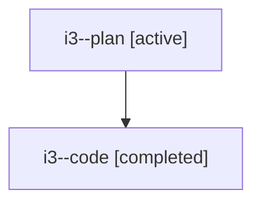

# Family: i3

[Agent Hoods](../README.md) / [bbugyi200](../users/bbugyi200/README.md) / [athena](../users/bbugyi200/machines/athena/README.md) / [i3](../users/bbugyi200/machines/athena/hoods/i3/README.md) / i3

Owner: `bbugyi200.athena` · Hood: `i3` · Members: 2

## Lineage

The diagram is an optional enhancement; the ordered table below contains the same lineage in accessible text.

| Role | Agent | State | Model / provider | Timing | Commits | Prompt | Chat |
|---|---|---|---|---|---:|---|---|
| plan | i3--plan | active | gpt-5.6-sol / codex | 2026-07-22T13:01:36.790897+00:00 | 0 | [Prompt](../agents/bbugyi200.athena.i3--plan/prompt.md) | [Chat](../agents/bbugyi200.athena.i3--plan/chat.md) |
| code | i3--code | completed | gpt-5.6-sol / codex | 2026-07-22T13:18:26.980248+00:00 | [1](../agents/bbugyi200.athena.i3--code/README.md#commits) | — | [Chat](../agents/bbugyi200.athena.i3--code/chat.md) |

## Commits

| Role | Repo | Commit | Subject | Committed (UTC) |
|---|---|---|---|---|
| code | sase | [`3543cd2`](https://github.com/sase-org/sase/commit/3543cd2a43ef0da449b2ff5591844a9c034d7802) | fix(tui): align TODO annotations with running gold | 2026-07-22 13:32:56 |

## Neighbors

| Agent | Relation | State |
|---|---|---|
| [i3.f0](bbugyi200.athena.i3.f0.md) (family · 2) | descendant | active 1, completed 1 |
| [i3.f0](../agents/bbugyi200.athena.i3.f0/README.md) | descendant | completed |
