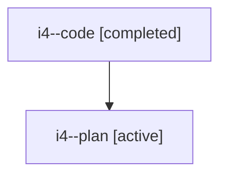

# Family: i4

Owner: `bbugyi200.athena` · Hood: `i4` · Members: 2

## Lineage

The diagram is an optional enhancement; the ordered table below contains the same lineage in accessible text.

| Role | Agent | State | Model / provider | Timing | Commits | Prompt | Chat |
|---|---|---|---|---|---:|---|---|
| code | i4--code | completed | gpt-5.6-sol / codex | 2026-07-22T13:18:37.369651+00:00 | 1 | — | [Chat](../agents/bbugyi200.athena.i4--code/chat.md) |
| plan | i4--plan | active | opus / claude | 2026-07-22T13:03:42.990503+00:00 | 0 | [Prompt](../agents/bbugyi200.athena.i4--plan/prompt.md) | [Chat](../agents/bbugyi200.athena.i4--plan/chat.md) |
