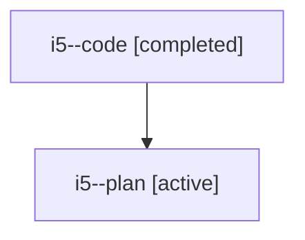

# Family: i5

[Agent Hoods](../README.md) / [bbugyi200](../users/bbugyi200/README.md) / [athena](../users/bbugyi200/machines/athena/README.md) / [i5](../users/bbugyi200/machines/athena/hoods/i5/README.md) / i5

Owner: `bbugyi200.athena` · Hood: `i5` · Members: 2

## Lineage

The diagram is an optional enhancement; the ordered table below contains the same lineage in accessible text.

| Role | Agent | State | Model / provider | Timing | Commits | Prompt | Chat |
|---|---|---|---|---|---:|---|---|
| code | i5--code | completed | gpt-5.6-sol / codex | 2026-07-22T13:44:25.033583+00:00 | [1](../agents/bbugyi200.athena.i5--code/README.md#commits) | — | [Chat](../agents/bbugyi200.athena.i5--code/chat.md) |
| plan | i5--plan | active | opus / claude | 2026-07-22T13:31:02.031533+00:00 | 0 | [Prompt](../agents/bbugyi200.athena.i5--plan/prompt.md) | [Chat](../agents/bbugyi200.athena.i5--plan/chat.md) |

## Commits

| Role | Commit | Subject | Committed (UTC) |
|---|---|---|---|
| code | [`6b3457b`](https://github.com/sase-org/sase/commit/6b3457b0bc765201ca33a8a80fddf544ae3a67cb) | feat(cli)!: infer plan validation tier | 2026-07-22 13:55:40 |
