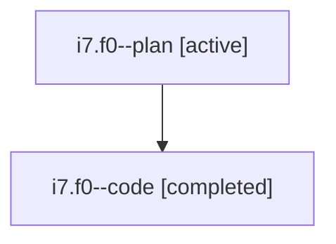

# Family: i7.f0

[Agent Hoods](../README.md) / [bbugyi200](../users/bbugyi200/README.md) / [athena](../users/bbugyi200/machines/athena/README.md) / [i7](../users/bbugyi200/machines/athena/hoods/i7/README.md) / i7.f0

Owner: `bbugyi200.athena` · Hood: `i7` · Members: 2

## Lineage

The diagram is an optional enhancement; the ordered table below contains the same lineage in accessible text.

| Role | Agent | State | Model / provider | Timing | Commits | Prompt | Chat |
|---|---|---|---|---|---:|---|---|
| plan | i7.f0--plan | active | gpt-5.6-sol / codex | 2026-07-22T14:57:44.244069+00:00 | 0 | [Prompt](../agents/bbugyi200.athena.i7.f0--plan/prompt.md) | [Chat](../agents/bbugyi200.athena.i7.f0--plan/chat.md) |
| code | i7.f0--code | completed | gpt-5.6-sol / codex | 2026-07-22T15:01:34.274674+00:00 | [1](../agents/bbugyi200.athena.i7.f0--code/README.md#commits) | — | [Chat](../agents/bbugyi200.athena.i7.f0--code/chat.md) |

## Commits

| Role | Repo | Commit | Subject | Committed |
|---|---|---|---|---|
| code | sase | [`6d6cf8e`](https://github.com/sase-org/sase/commit/6d6cf8e773f6bf192af569829262d67c3b1dc96d) | fix(ace): use deep navy for TODO markers | 2026-07-22 15:27:07 UTC |

## Neighbors

| Agent | Relation | State |
|---|---|---|
| [i7](../agents/bbugyi200.athena.i7/README.md) | ancestor | active |
