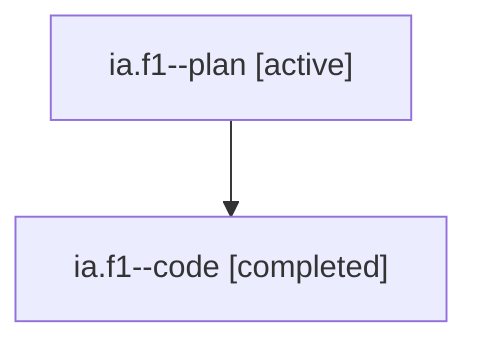

# Family: ia.f1

Owner: `bbugyi200.athena` · Hood: `ia` · Members: 2

## Lineage

The diagram is an optional enhancement; the ordered table below contains the same lineage in accessible text.

| Role | Agent | State | Model / provider | Timing | Commits | Prompt | Chat |
|---|---|---|---|---|---:|---|---|
| plan | ia.f1--plan | active | gpt-5.6-sol / codex | 2026-07-22T15:17:45.576110+00:00 | 0 | [Prompt](../agents/bbugyi200.athena.ia.f1--plan/prompt.md) | [Chat](../agents/bbugyi200.athena.ia.f1--plan/chat.md) |
| code | ia.f1--code | completed | gpt-5.6-sol / codex | 2026-07-22T15:23:54.645148+00:00 | 1 | — | [Chat](../agents/bbugyi200.athena.ia.f1--code/chat.md) |
