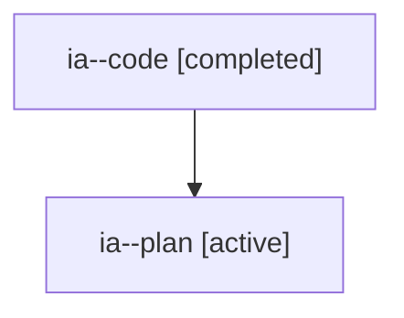

# Family: ia

[Agent Hoods](../README.md) / [bbugyi200](../users/bbugyi200/README.md) / [athena](../users/bbugyi200/machines/athena/README.md) / [ia](../users/bbugyi200/machines/athena/hoods/ia/README.md) / ia

Owner: `bbugyi200.athena` · Hood: `ia` · Members: 2

## Lineage

The diagram is an optional enhancement; the ordered table below contains the same lineage in accessible text.

| Role | Agent | State | Model / provider | Timing | Commits | Prompt | Chat |
|---|---|---|---|---|---:|---|---|
| code | ia--code | completed | gpt-5.6-sol / codex | 2026-07-22T14:51:07.705521+00:00 | [1](../agents/bbugyi200.athena.ia--code/README.md#commits) | — | [Chat](../agents/bbugyi200.athena.ia--code/chat.md) |
| plan | ia--plan | active | gpt-5.6-sol / codex | 2026-07-22T14:42:21.848411+00:00 | 0 | [Prompt](../agents/bbugyi200.athena.ia--plan/prompt.md) | [Chat](../agents/bbugyi200.athena.ia--plan/chat.md) |

## Commits

| Role | Repo | Commit | Subject | Committed |
|---|---|---|---|---|
| code | sase | [`1232a8c`](https://github.com/sase-org/sase/commit/1232a8c1c91b6dcabb6fb5d0959d631b7135d6a1) | fix(ace): count agent holes in headline | 2026-07-22 11:16:42 EDT |

## Neighbors

| Agent | Relation | State |
|---|---|---|
| [ia.f1](bbugyi200.athena.ia.f1.md) (family · 2) | descendant | active 1, completed 1 |
| [ia.f1](../agents/bbugyi200.athena.ia.f1/README.md) | descendant | completed |
| [ia.f1.f0](bbugyi200.athena.ia.f1.f0.md) (family · 2) | descendant | active 1, completed 1 |
| [ia.f1.f0](../agents/bbugyi200.athena.ia.f1.f0/README.md) | descendant | completed |
