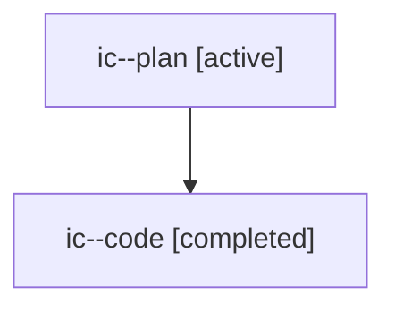

# Family: ic

[Agent Hoods](../README.md) / [bbugyi200](../users/bbugyi200/README.md) / [athena](../users/bbugyi200/machines/athena/README.md) / [ic](../users/bbugyi200/machines/athena/hoods/ic/README.md) / ic

Owner: `bbugyi200.athena` · Hood: `ic` · Members: 2

## Lineage

The diagram is an optional enhancement; the ordered table below contains the same lineage in accessible text.

| Role | Agent | State | Model / provider | Timing | Commits | Prompt | Chat |
|---|---|---|---|---|---:|---|---|
| plan | ic--plan | active | gpt-5.6-sol / codex | 2026-07-22T15:03:12.527996+00:00 | 0 | [Prompt](../agents/bbugyi200.athena.ic--plan/prompt.md) | [Chat](../agents/bbugyi200.athena.ic--plan/chat.md) |
| code | ic--code | completed | gpt-5.6-sol / codex | 2026-07-22T15:08:32.645720+00:00 | [1](../agents/bbugyi200.athena.ic--code/README.md#commits) | — | [Chat](../agents/bbugyi200.athena.ic--code/chat.md) |

## Commits

| Role | Repo | Commit | Subject | Committed |
|---|---|---|---|---|
| code | sase | [`7917c0f`](https://github.com/sase-org/sase/commit/7917c0f79fece6d823e200233d1cc8220ab66027) | fix(tui): show clan members before summary | 2026-07-22 15:43:18 UTC |
