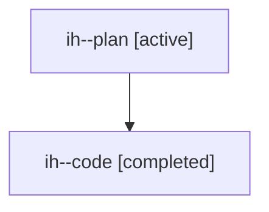

# Family: ih

[Agent Hoods](../README.md) / [bbugyi200](../users/bbugyi200/README.md) / [athena](../users/bbugyi200/machines/athena/README.md) / [ih](../users/bbugyi200/machines/athena/hoods/ih/README.md) / ih

Owner: `bbugyi200.athena` · Hood: `ih` · Members: 2

## Lineage

The diagram is an optional enhancement; the ordered table below contains the same lineage in accessible text.

| Role | Agent | State | Model / provider | Timing | Commits | Prompt | Chat |
|---|---|---|---|---|---:|---|---|
| plan | ih--plan | active | gpt-5.6-sol / codex | 2026-07-22T16:13:47.104581+00:00 | 0 | [Prompt](../agents/bbugyi200.athena.ih--plan/prompt.md) | [Chat](../agents/bbugyi200.athena.ih--plan/chat.md) |
| code | ih--code | completed | gpt-5.6-sol / codex | 2026-07-22T16:21:47.824381+00:00 | 0 | — | [Chat](../agents/bbugyi200.athena.ih--code/chat.md) |
