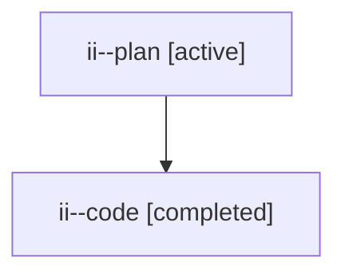

# Family: ii

[Agent Hoods](../README.md) / [bbugyi200](../users/bbugyi200/README.md) / [athena](../users/bbugyi200/machines/athena/README.md) / [ii](../users/bbugyi200/machines/athena/hoods/ii/README.md) / ii

Owner: `bbugyi200.athena` · Hood: `ii` · Members: 2

## Lineage

The diagram is an optional enhancement; the ordered table below contains the same lineage in accessible text.

| Role | Agent | State | Model / provider | Timing | Commits | Prompt | Chat |
|---|---|---|---|---|---:|---|---|
| plan | ii--plan | active | opus / claude | 2026-07-22T16:15:44.418365+00:00 | 0 | [Prompt](../agents/bbugyi200.athena.ii--plan/prompt.md) | [Chat](../agents/bbugyi200.athena.ii--plan/chat.md) |
| code | ii--code | completed | gpt-5.6-sol / codex | 2026-07-22T16:27:12.553906+00:00 | [1](../agents/bbugyi200.athena.ii--code/README.md#commits) | — | [Chat](../agents/bbugyi200.athena.ii--code/chat.md) |

## Commits

| Role | Repo | Commit | Subject | Committed (UTC) |
|---|---|---|---|---|
| code | sase | [`c05db01`](https://github.com/sase-org/sase/commit/c05db016318c53f7394ad4a3f54fcd66221189e3) | fix(ace): preserve clan member name during kill and edit | 2026-07-22 17:00:22 |
