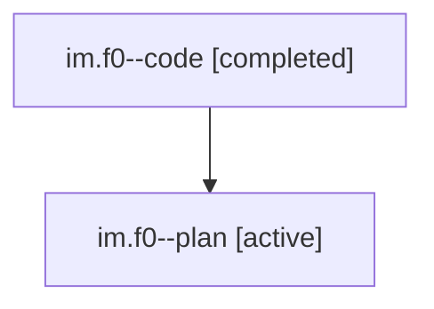

# Family: im.f0

[Agent Hoods](../README.md) / [bbugyi200](../users/bbugyi200/README.md) / [athena](../users/bbugyi200/machines/athena/README.md) / [im](../users/bbugyi200/machines/athena/hoods/im/README.md) / im.f0

Owner: `bbugyi200.athena` · Hood: `im` · Members: 2

## Lineage

The diagram is an optional enhancement; the ordered table below contains the same lineage in accessible text.

| Role | Agent | State | Model / provider | Timing | Commits | Prompt | Chat |
|---|---|---|---|---|---:|---|---|
| code | im.f0--code | completed | gpt-5.6-sol / codex | 2026-07-22T18:37:35.745207+00:00 | [1](../agents/bbugyi200.athena.im.f0--code/README.md#commits) | — | [Chat](../agents/bbugyi200.athena.im.f0--code/chat.md) |
| plan | im.f0--plan | active | gpt-5.6-sol / codex | 2026-07-22T18:25:28.706053+00:00 | 0 | [Prompt](../agents/bbugyi200.athena.im.f0--plan/prompt.md) | [Chat](../agents/bbugyi200.athena.im.f0--plan/chat.md) |

## Commits

| Role | Repo | Commit | Subject | Committed |
|---|---|---|---|---|
| code | sase | [`5fb55a5`](https://github.com/sase-org/sase/commit/5fb55a5a98e91fbc807d3e008f3af55d3d3863a1) | fix: recover interrupted agent families during forced reuse | 2026-07-22 15:03:36 EDT |

## Neighbors

| Agent | Relation | State |
|---|---|---|
| [im](../agents/bbugyi200.athena.im/README.md) | ancestor | active |
