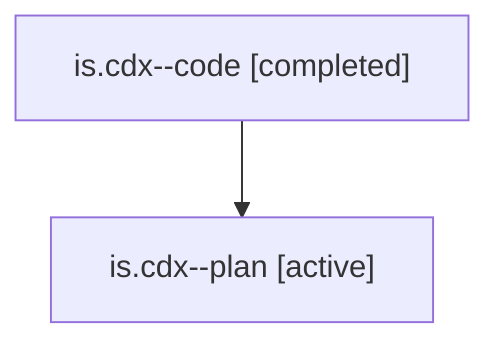

# Family: is.cdx

[Agent Hoods](../README.md) / [bbugyi200](../users/bbugyi200/README.md) / [athena](../users/bbugyi200/machines/athena/README.md) / [is](../users/bbugyi200/machines/athena/hoods/is/README.md) / is.cdx

Owner: `bbugyi200.athena` · Hood: `is` · Members: 2

## Lineage

The diagram is an optional enhancement; the ordered table below contains the same lineage in accessible text.

| Role | Agent | State | Model / provider | Timing | Commits | Prompt | Chat |
|---|---|---|---|---|---:|---|---|
| code | is.cdx--code | completed | gpt-5.6-sol / codex | 2026-07-23T11:32:56.539812+00:00 | [1](../agents/bbugyi200.athena.is.cdx--code/README.md#commits) | — | [Chat](../agents/bbugyi200.athena.is.cdx--code/chat.md) |
| plan | is.cdx--plan | active | gpt-5.6-sol / codex | 2026-07-23T11:13:28.372546+00:00 | 0 | [Prompt](../agents/bbugyi200.athena.is.cdx--plan/prompt.md) | [Chat](../agents/bbugyi200.athena.is.cdx--plan/chat.md) |

## Commits

| Role | Commit | Subject | Committed (UTC) |
|---|---|---|---|
| code | [`9e35517`](https://github.com/sase-org/sase/commit/9e355175c9af4fe649101a1990d3c1ef9955ace4) | perf: reuse machine identity during registry rebuild | 2026-07-23 12:01:16 |

## Neighbors

| Agent | Relation | State |
|---|---|---|
| [is.cld](../agents/bbugyi200.athena.is.cld/README.md) | is hood | active |
