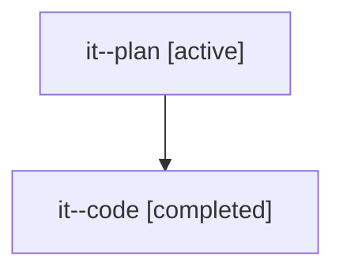

# Family: it

Owner: `bbugyi200.athena` · Hood: `it` · Members: 2

## Lineage

The diagram is an optional enhancement; the ordered table below contains the same lineage in accessible text.

| Role | Agent | State | Model / provider | Timing | Commits | Prompt | Chat |
|---|---|---|---|---|---:|---|---|
| plan | it--plan | active | opus / claude | 2026-07-23T11:10:34.866119+00:00 | 0 | [Prompt](../agents/bbugyi200.athena.it--plan/prompt.md) | [Chat](../agents/bbugyi200.athena.it--plan/chat.md) |
| code | it--code | completed | gpt-5.6-sol / codex | 2026-07-23T11:34:22.034133+00:00 | 1 | — | [Chat](../agents/bbugyi200.athena.it--code/chat.md) |
