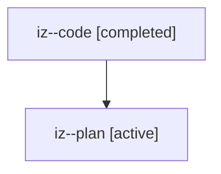

# Family: iz

[Agent Hoods](../README.md) / [bbugyi200](../users/bbugyi200/README.md) / [athena](../users/bbugyi200/machines/athena/README.md) / [iz](../users/bbugyi200/machines/athena/hoods/iz/README.md) / iz

Owner: `bbugyi200.athena` · Hood: `iz` · Members: 2

## Lineage

The diagram is an optional enhancement; the ordered table below contains the same lineage in accessible text.

| Role | Agent | State | Model / provider | Timing | Commits | Prompt | Chat |
|---|---|---|---|---|---:|---|---|
| code | iz--code | completed | gpt-5.6-sol / codex | 2026-07-23T13:56:10.939657+00:00 | [1](../agents/bbugyi200.athena.iz--code/README.md#commits) | — | [Chat](../agents/bbugyi200.athena.iz--code/chat.md) |
| plan | iz--plan | active | gpt-5.6-sol / codex | 2026-07-23T13:44:22.561655+00:00 | 0 | [Prompt](../agents/bbugyi200.athena.iz--plan/prompt.md) | [Chat](../agents/bbugyi200.athena.iz--plan/chat.md) |

## Commits

| Role | Repo | Commit | Subject | Committed |
|---|---|---|---|---|
| code | sase | [`cf8832b`](https://github.com/sase-org/sase/commit/cf8832b7e8bf6a99183e9de9535945ceb3ce3c5d) | fix(config): make machine identity optional per document | 2026-07-23 14:06:01 UTC |
