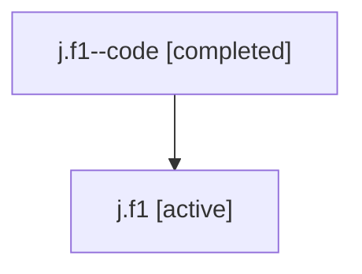

# Family: j.f1

[Agent Hoods](../README.md) / [bbugyi200](../users/bbugyi200/README.md) / [athena](../users/bbugyi200/machines/athena/README.md) / [j](../users/bbugyi200/machines/athena/hoods/j/README.md) / j.f1

Owner: `bbugyi200.athena` · Hood: `j` · Members: 2

## Lineage

The diagram is an optional enhancement; the ordered table below contains the same lineage in accessible text.

| Role | Agent | State | Model / provider | Timing | Commits | Prompt | Chat |
|---|---|---|---|---|---:|---|---|
| code | j.f1--code | completed | gpt-5.5 / codex | 2026-07-06T18:51:29.978648+00:00 | [1](../agents/bbugyi200.athena.j.f1--code/README.md#commits) | — | [Chat](../agents/bbugyi200.athena.j.f1--code/chat.md) |
| root | j.f1 | active | claude-fable-5 / claude | 2026-07-06T18:43:58.642332+00:00 | [1](../agents/bbugyi200.athena.j.f1/README.md#commits) | [Prompt](../agents/bbugyi200.athena.j.f1/prompt.md) | [Chat](../agents/bbugyi200.athena.j.f1/chat.md) |

## Commits

| Role | Repo | Commit | Subject | Committed |
|---|---|---|---|---|
| root | sase | [`fe6cb66`](https://github.com/sase-org/sase/commit/fe6cb668a6b112c7e877472c8252fc6c2c206480) | chore: Add SDD prompt and plan for typed\_linked\_repo\_prep | 2026-07-06 14:51:28 EDT |
| code | sase | [`3646c82`](https://github.com/sase-org/sase/commit/3646c82849cedd3289a2fe1bcb9c7412de68b534) | fix: use fresh linked repo resolution for prep | 2026-07-06 15:02:04 EDT |

## Neighbors

| Agent | Relation | State |
|---|---|---|
| [j](bbugyi200.athena.j.md) (family · 2) | ancestor | active 1, completed 1 |
