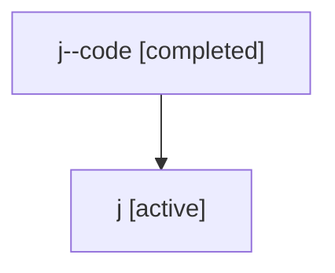

# Family: j

[Agent Hoods](../README.md) / [bbugyi200](../users/bbugyi200/README.md) / [athena](../users/bbugyi200/machines/athena/README.md) / [j](../users/bbugyi200/machines/athena/hoods/j/README.md) / j

Owner: `bbugyi200.athena` · Hood: `j` · Members: 2

## Lineage

The diagram is an optional enhancement; the ordered table below contains the same lineage in accessible text.

| Role | Agent | State | Model / provider | Timing | Commits | Prompt | Chat |
|---|---|---|---|---|---:|---|---|
| code | j--code | completed | gpt-5.5 / codex | 2026-07-06T18:22:12.507322+00:00 | [1](../agents/bbugyi200.athena.j--code/README.md#commits) | — | [Chat](../agents/bbugyi200.athena.j--code/chat.md) |
| root | j | active | gpt-5.5 / codex | 2026-07-06T18:15:11.706945+00:00 | [2](../agents/bbugyi200.athena.j/README.md#commits) | [Prompt](../agents/bbugyi200.athena.j/prompt.md) | [Chat](../agents/bbugyi200.athena.j/chat.md) |

## Commits

| Role | Commit | Subject | Committed (UTC) |
|---|---|---|---|
| root | [`a30415a`](https://github.com/sase-org/sase/commit/a30415a7255b2a8ba5bad5458f3968e216e05ff4) | chore: Add SDD prompt and plan for fix\_chop\_linked\_repo\_skew | 2026-07-06 18:22:11 |
| code | [`f672125`](https://github.com/sase-org/sase/commit/f672125c50dd7456b4f02fb16d485ad8a5ecf00d) | fix: prepare linked repo workspaces before agent launch | 2026-07-06 18:38:09 |
| root | [`f672125`](https://github.com/sase-org/sase/commit/f672125c50dd7456b4f02fb16d485ad8a5ecf00d) | fix: prepare linked repo workspaces before agent launch | 2026-07-06 18:38:09 |

## Neighbors

| Agent | Relation | State |
|---|---|---|
| [j.f1](bbugyi200.athena.j.f1.md) (family · 2) | descendant | active 1, completed 1 |
