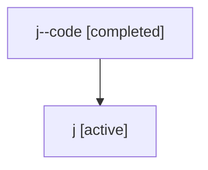

# Family: j

Owner: `bbugyi200.athena` · Hood: `j` · Members: 2

## Lineage

The diagram is an optional enhancement; the ordered table below contains the same lineage in accessible text.

| Role | Agent | State | Model / provider | Timing | Commits | Prompt | Chat |
|---|---|---|---|---|---:|---|---|
| code | j--code | completed | gpt-5.5 / codex | 2026-07-06T18:22:12.507322+00:00 | 1 | — | [Chat](../agents/bbugyi200.athena.j--code/chat.md) |
| root | j | active | gpt-5.5 / codex | 2026-07-06T18:15:11.706945+00:00 | 2 | [Prompt](../agents/bbugyi200.athena.j/prompt.md) | [Chat](../agents/bbugyi200.athena.j/chat.md) |
