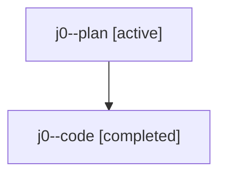

# Family: j0

[Agent Hoods](../README.md) / [bbugyi200](../users/bbugyi200/README.md) / [athena](../users/bbugyi200/machines/athena/README.md) / [j0](../users/bbugyi200/machines/athena/hoods/j0/README.md) / j0

Owner: `bbugyi200.athena` · Hood: `j0` · Members: 2

## Lineage

The diagram is an optional enhancement; the ordered table below contains the same lineage in accessible text.

| Role | Agent | State | Model / provider | Timing | Commits | Prompt | Chat |
|---|---|---|---|---|---:|---|---|
| plan | j0--plan | active | gpt-5.6-sol / codex | 2026-07-23T14:02:34.926092+00:00 | 0 | [Prompt](../agents/bbugyi200.athena.j0--plan/prompt.md) | [Chat](../agents/bbugyi200.athena.j0--plan/chat.md) |
| code | j0--code | completed | gpt-5.6-sol / codex | 2026-07-23T14:19:27.166975+00:00 | [1](../agents/bbugyi200.athena.j0--code/README.md#commits) | — | [Chat](../agents/bbugyi200.athena.j0--code/chat.md) |

## Commits

| Role | Repo | Commit | Subject | Committed |
|---|---|---|---|---|
| code | sase | [`da207ba`](https://github.com/sase-org/sase/commit/da207ba769eba6a058c408c04162adda0d3556dd) | fix(ace): respect Markdown structure in TODO highlighting | 2026-07-23 10:39:20 EDT |
