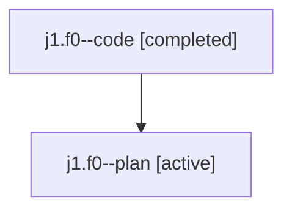

# Family: j1.f0

[Agent Hoods](../README.md) / [bbugyi200](../users/bbugyi200/README.md) / [athena](../users/bbugyi200/machines/athena/README.md) / [j1](../users/bbugyi200/machines/athena/hoods/j1/README.md) / j1.f0

Owner: `bbugyi200.athena` · Hood: `j1` · Members: 2

## Lineage

The diagram is an optional enhancement; the ordered table below contains the same lineage in accessible text.

| Role | Agent | State | Model / provider | Timing | Commits | Prompt | Chat |
|---|---|---|---|---|---:|---|---|
| code | j1.f0--code | completed | gpt-5.6-sol / codex | 2026-07-23T14:46:15.752459+00:00 | 0 | — | [Chat](../agents/bbugyi200.athena.j1.f0--code/chat.md) |
| plan | j1.f0--plan | active | gpt-5.6-sol / codex | 2026-07-23T14:40:03.786320+00:00 | 0 | [Prompt](../agents/bbugyi200.athena.j1.f0--plan/prompt.md) | [Chat](../agents/bbugyi200.athena.j1.f0--plan/chat.md) |

## Neighbors

| Agent | Relation | State |
|---|---|---|
| [j1](../agents/bbugyi200.athena.j1/README.md) | ancestor | completed |
