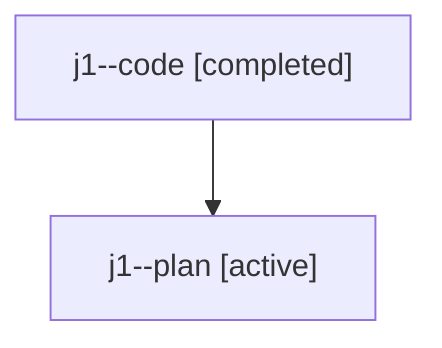

# Family: j1

[Agent Hoods](../README.md) / [bbugyi200](../users/bbugyi200/README.md) / [athena](../users/bbugyi200/machines/athena/README.md) / [j1](../users/bbugyi200/machines/athena/hoods/j1/README.md) / j1

Owner: `bbugyi200.athena` · Hood: `j1` · Members: 2

## Lineage

The diagram is an optional enhancement; the ordered table below contains the same lineage in accessible text.

| Role | Agent | State | Model / provider | Timing | Commits | Prompt | Chat |
|---|---|---|---|---|---:|---|---|
| code | j1--code | completed | gpt-5.6-sol / codex | 2026-07-23T14:26:25.152851+00:00 | [1](../agents/bbugyi200.athena.j1--code/README.md#commits) | — | [Chat](../agents/bbugyi200.athena.j1--code/chat.md) |
| plan | j1--plan | active | gpt-5.6-sol / codex | 2026-07-23T14:19:16.832048+00:00 | 0 | [Prompt](../agents/bbugyi200.athena.j1--plan/prompt.md) | [Chat](../agents/bbugyi200.athena.j1--plan/chat.md) |

## Commits

| Role | Commit | Subject | Committed (UTC) |
|---|---|---|---|
| code | [`2695bf7`](https://github.com/sase-org/sase/commit/2695bf72af57c11f71b2110430c4468b8ac192c4) | feat(ace): continue prompt bullets on Ctrl+J | 2026-07-23 14:33:44 |

## Neighbors

| Agent | Relation | State |
|---|---|---|
| [j1.f0](bbugyi200.athena.j1.f0.md) (family · 2) | descendant | active 1, completed 1 |
| [j1.f0](../agents/bbugyi200.athena.j1.f0/README.md) | descendant | completed |
