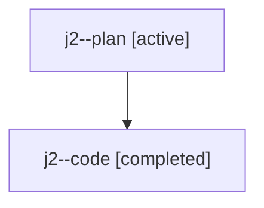

# Family: j2

[Agent Hoods](../README.md) / [bbugyi200](../users/bbugyi200/README.md) / [athena](../users/bbugyi200/machines/athena/README.md) / [j2](../users/bbugyi200/machines/athena/hoods/j2/README.md) / j2

Owner: `bbugyi200.athena` · Hood: `j2` · Members: 2

## Lineage

The diagram is an optional enhancement; the ordered table below contains the same lineage in accessible text.

| Role | Agent | State | Model / provider | Timing | Commits | Prompt | Chat |
|---|---|---|---|---|---:|---|---|
| plan | j2--plan | active | gpt-5.6-sol / codex | 2026-07-23T14:26:08.487461+00:00 | 0 | [Prompt](../agents/bbugyi200.athena.j2--plan/prompt.md) | [Chat](../agents/bbugyi200.athena.j2--plan/chat.md) |
| code | j2--code | completed | gpt-5.6-sol / codex | 2026-07-23T14:37:28.693777+00:00 | [1](../agents/bbugyi200.athena.j2--code/README.md#commits) | — | [Chat](../agents/bbugyi200.athena.j2--code/chat.md) |

## Commits

| Role | Repo | Commit | Subject | Committed (UTC) |
|---|---|---|---|---|
| code | sase | [`330c258`](https://github.com/sase-org/sase/commit/330c25856f83465adfefe190495f6ddbc3369867) | fix: restart exact agent family members | 2026-07-23 15:03:00 |
