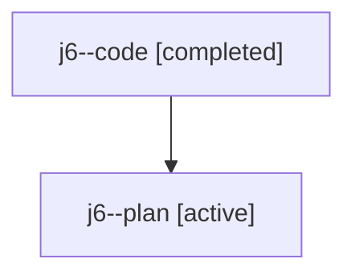

# Family: j6

Owner: `bbugyi200.athena` · Hood: `j6` · Members: 2

## Lineage

The diagram is an optional enhancement; the ordered table below contains the same lineage in accessible text.

| Role | Agent | State | Model / provider | Timing | Commits | Prompt | Chat |
|---|---|---|---|---|---:|---|---|
| code | j6--code | completed | gpt-5.6-sol / codex | 2026-07-23T15:49:57.845120+00:00 | 1 | — | [Chat](../agents/bbugyi200.athena.j6--code/chat.md) |
| plan | j6--plan | active | gpt-5.6-sol / codex | 2026-07-23T15:40:58.001446+00:00 | 0 | [Prompt](../agents/bbugyi200.athena.j6--plan/prompt.md) | [Chat](../agents/bbugyi200.athena.j6--plan/chat.md) |
