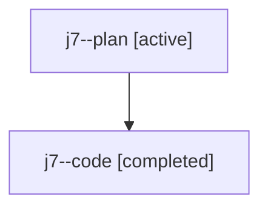

# Family: j7

[Agent Hoods](../README.md) / [bbugyi200](../users/bbugyi200/README.md) / [athena](../users/bbugyi200/machines/athena/README.md) / [j7](../users/bbugyi200/machines/athena/hoods/j7/README.md) / j7

Owner: `bbugyi200.athena` · Hood: `j7` · Members: 2

## Lineage

The diagram is an optional enhancement; the ordered table below contains the same lineage in accessible text.

| Role | Agent | State | Model / provider | Timing | Commits | Prompt | Chat |
|---|---|---|---|---|---:|---|---|
| plan | j7--plan | active | opus / claude | 2026-07-23T15:48:10.579290+00:00 | 0 | [Prompt](../agents/bbugyi200.athena.j7--plan/prompt.md) | [Chat](../agents/bbugyi200.athena.j7--plan/chat.md) |
| code | j7--code | completed | gpt-5.6-sol / codex | 2026-07-23T16:03:04.813827+00:00 | [1](../agents/bbugyi200.athena.j7--code/README.md#commits) | — | [Chat](../agents/bbugyi200.athena.j7--code/chat.md) |

## Commits

| Role | Repo | Commit | Subject | Committed |
|---|---|---|---|---|
| code | sase | [`485e562`](https://github.com/sase-org/sase/commit/485e5624ef9630119bd3e4fa2a11c0d1f51d743e) | fix(bead)!: confirm destructive forced-reuse cleanup | 2026-07-23 12:22:01 EDT |
