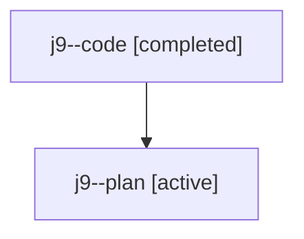

# Family: j9

[Agent Hoods](../README.md) / [bbugyi200](../users/bbugyi200/README.md) / [athena](../users/bbugyi200/machines/athena/README.md) / [j9](../users/bbugyi200/machines/athena/hoods/j9/README.md) / j9

Owner: `bbugyi200.athena` · Hood: `j9` · Members: 2

## Lineage

The diagram is an optional enhancement; the ordered table below contains the same lineage in accessible text.

| Role | Agent | State | Model / provider | Timing | Commits | Prompt | Chat |
|---|---|---|---|---|---:|---|---|
| code | j9--code | completed | gpt-5.6-sol / codex | 2026-07-23T16:40:19.012590+00:00 | [1](../agents/bbugyi200.athena.j9--code/README.md#commits) | — | [Chat](../agents/bbugyi200.athena.j9--code/chat.md) |
| plan | j9--plan | active | opus / claude | 2026-07-23T16:16:26.396300+00:00 | 0 | [Prompt](../agents/bbugyi200.athena.j9--plan/prompt.md) | [Chat](../agents/bbugyi200.athena.j9--plan/chat.md) |

## Commits

| Role | Repo | Commit | Subject | Committed (UTC) |
|---|---|---|---|---|
| code | sase | [`215721f`](https://github.com/sase-org/sase/commit/215721fd5a17f70ba42937223cd3db84411a66a3) | feat(pdf): render plan frontmatter as properties cards | 2026-07-23 17:01:34 |
