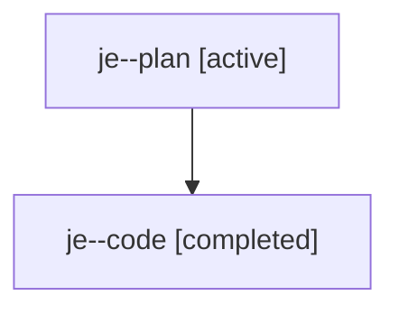

# Family: je

[Agent Hoods](../README.md) / [bbugyi200](../users/bbugyi200/README.md) / [athena](../users/bbugyi200/machines/athena/README.md) / [je](../users/bbugyi200/machines/athena/hoods/je/README.md) / je

Owner: `bbugyi200.athena` · Hood: `je` · Members: 2

## Lineage

The diagram is an optional enhancement; the ordered table below contains the same lineage in accessible text.

| Role | Agent | State | Model / provider | Timing | Commits | Prompt | Chat |
|---|---|---|---|---|---:|---|---|
| plan | je--plan | active | gpt-5.6-sol / codex | 2026-07-23T16:56:27.322688+00:00 | 0 | [Prompt](../agents/bbugyi200.athena.je--plan/prompt.md) | [Chat](../agents/bbugyi200.athena.je--plan/chat.md) |
| code | je--code | completed | gpt-5.6-sol / codex | 2026-07-23T17:01:49.279014+00:00 | 0 | — | [Chat](../agents/bbugyi200.athena.je--code/chat.md) |
