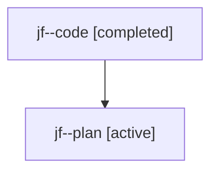

# Family: jf

[Agent Hoods](../README.md) / [bbugyi200](../users/bbugyi200/README.md) / [athena](../users/bbugyi200/machines/athena/README.md) / [jf](../users/bbugyi200/machines/athena/hoods/jf/README.md) / jf

Owner: `bbugyi200.athena` · Hood: `jf` · Members: 2

## Lineage

The diagram is an optional enhancement; the ordered table below contains the same lineage in accessible text.

| Role | Agent | State | Model / provider | Timing | Commits | Prompt | Chat |
|---|---|---|---|---|---:|---|---|
| code | jf--code | completed | gpt-5.6-sol / codex | 2026-07-23T17:16:22.725682+00:00 | [1](../agents/bbugyi200.athena.jf--code/README.md#commits) | — | [Chat](../agents/bbugyi200.athena.jf--code/chat.md) |
| plan | jf--plan | active | gpt-5.6-sol / codex | 2026-07-23T17:10:24.678221+00:00 | 0 | [Prompt](../agents/bbugyi200.athena.jf--plan/prompt.md) | [Chat](../agents/bbugyi200.athena.jf--plan/chat.md) |

## Commits

| Role | Repo | Commit | Subject | Committed |
|---|---|---|---|---|
| code | sase | [`f3965dd`](https://github.com/sase-org/sase/commit/f3965dd19e48a7be84658da43e92ef891d9d2583) | refactor(ace): rename agent holes to lanes | 2026-07-23 17:50:00 UTC |
