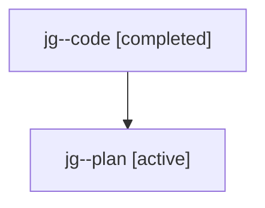

# Family: jg

[Agent Hoods](../README.md) / [bbugyi200](../users/bbugyi200/README.md) / [athena](../users/bbugyi200/machines/athena/README.md) / [jg](../users/bbugyi200/machines/athena/hoods/jg/README.md) / jg

Owner: `bbugyi200.athena` · Hood: `jg` · Members: 2

## Lineage

The diagram is an optional enhancement; the ordered table below contains the same lineage in accessible text.

| Role | Agent | State | Model / provider | Timing | Commits | Prompt | Chat |
|---|---|---|---|---|---:|---|---|
| code | jg--code | completed | gpt-5.6-sol / codex | 2026-07-23T17:28:18.184950+00:00 | [1](../agents/bbugyi200.athena.jg--code/README.md#commits) | — | [Chat](../agents/bbugyi200.athena.jg--code/chat.md) |
| plan | jg--plan | active | opus / claude | 2026-07-23T17:19:26.799381+00:00 | 0 | [Prompt](../agents/bbugyi200.athena.jg--plan/prompt.md) | [Chat](../agents/bbugyi200.athena.jg--plan/chat.md) |

## Commits

| Role | Commit | Subject | Committed (UTC) |
|---|---|---|---|
| code | [`06338fc`](https://github.com/sase-org/sase/commit/06338fc148dbad0297cf94fa90651680a72817a1) | feat(ace): clarify Help Guide tab content | 2026-07-23 17:58:50 |
