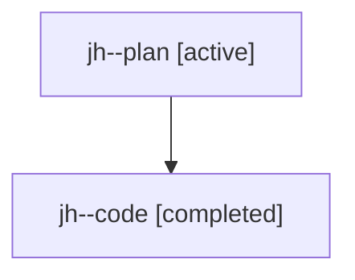

# Family: jh

[Agent Hoods](../README.md) / [bbugyi200](../users/bbugyi200/README.md) / [athena](../users/bbugyi200/machines/athena/README.md) / [jh](../users/bbugyi200/machines/athena/hoods/jh/README.md) / jh

Owner: `bbugyi200.athena` · Hood: `jh` · Members: 2

## Lineage

The diagram is an optional enhancement; the ordered table below contains the same lineage in accessible text.

| Role | Agent | State | Model / provider | Timing | Commits | Prompt | Chat |
|---|---|---|---|---|---:|---|---|
| plan | jh--plan | active | gpt-5.6-sol / codex | 2026-07-23T18:24:03.278656+00:00 | 0 | [Prompt](../agents/bbugyi200.athena.jh--plan/prompt.md) | [Chat](../agents/bbugyi200.athena.jh--plan/chat.md) |
| code | jh--code | completed | gpt-5.6-sol / codex | 2026-07-23T18:35:02.260037+00:00 | [1](../agents/bbugyi200.athena.jh--code/README.md#commits) | — | [Chat](../agents/bbugyi200.athena.jh--code/chat.md) |

## Commits

| Role | Repo | Commit | Subject | Committed (UTC) |
|---|---|---|---|---|
| code | sase | [`467fc76`](https://github.com/sase-org/sase/commit/467fc76b82222a7d44fd64cafdc5d86478746632) | fix(tui): include collapsed clan lanes in completions | 2026-07-23 18:44:47 |
