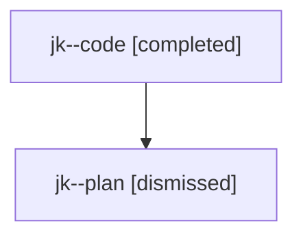

# Family: jk

[Agent Hoods](../README.md) / [bbugyi200](../users/bbugyi200/README.md) / [athena](../users/bbugyi200/machines/athena/README.md) / [jk](../users/bbugyi200/machines/athena/hoods/jk/README.md) / jk

Owner: `bbugyi200.athena` · Hood: `jk` · Members: 2

## Lineage

The diagram is an optional enhancement; the ordered table below contains the same lineage in accessible text.

| Role | Agent | State | Model / provider | Timing | Commits | Prompt | Chat |
|---|---|---|---|---|---:|---|---|
| code | jk--code | completed | gpt-5.6-sol / codex | 2026-07-24T18:39:12.725277+00:00 | [1](../agents/bbugyi200.athena.jk--code/README.md#commits) | — | [Chat](../agents/bbugyi200.athena.jk--code/chat.md) |
| plan | jk--plan | dismissed | opus / claude | 2026-07-24T14:29:12.187660 → 2026-07-24T15:00:15.404052 | 0 | — | [Chat](../agents/bbugyi200.athena.jk--plan/chat.md) |

## Commits

| Role | Commit | Subject | Committed (UTC) |
|---|---|---|---|
| code | [`abf8dd3`](https://github.com/sase-org/sase/commit/abf8dd3c48d446a3148d860af34cd7dbb6fe4e95) | feat(models): clarify alias ownership in Models panel | 2026-07-24 18:59:59 |

## Neighbors

| Agent | Relation | State |
|---|---|---|
| [jk.f0](../agents/bbugyi200.athena.jk.f0/README.md) | descendant | dismissed |
