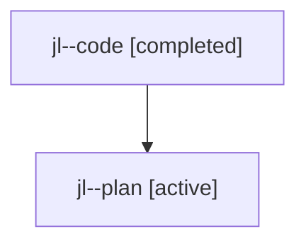

# Family: jl

[Agent Hoods](../README.md) / [bbugyi200](../users/bbugyi200/README.md) / [athena](../users/bbugyi200/machines/athena/README.md) / [jl](../users/bbugyi200/machines/athena/hoods/jl/README.md) / jl

Owner: `bbugyi200.athena` · Hood: `jl` · Members: 2

## Lineage

The diagram is an optional enhancement; the ordered table below contains the same lineage in accessible text.

| Role | Agent | State | Model / provider | Timing | Commits | Prompt | Chat |
|---|---|---|---|---|---:|---|---|
| code | jl--code | completed | gpt-5.6-sol / codex | 2026-07-24T19:58:22.751033+00:00 | 0 | — | [Chat](../agents/bbugyi200.athena.jl--code/chat.md) |
| plan | jl--plan | active | gpt-5.6-sol / codex | 2026-07-24T19:50:28.067677+00:00 | 0 | [Prompt](../agents/bbugyi200.athena.jl--plan/prompt.md) | [Chat](../agents/bbugyi200.athena.jl--plan/chat.md) |
