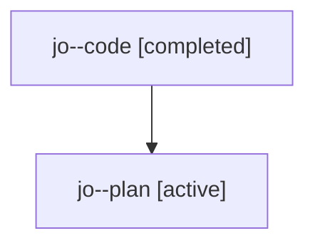

# Family: jo

[Agent Hoods](../README.md) / [bbugyi200](../users/bbugyi200/README.md) / [athena](../users/bbugyi200/machines/athena/README.md) / [jo](../users/bbugyi200/machines/athena/hoods/jo/README.md) / jo

Owner: `bbugyi200.athena` · Hood: `jo` · Members: 2

## Lineage

The diagram is an optional enhancement; the ordered table below contains the same lineage in accessible text.

| Role | Agent | State | Model / provider | Timing | Commits | Prompt | Chat |
|---|---|---|---|---|---:|---|---|
| code | jo--code | completed | gpt-5.6-sol / codex | 2026-07-24T21:15:19.613714+00:00 | [1](../agents/bbugyi200.athena.jo--code/README.md#commits) | — | [Chat](../agents/bbugyi200.athena.jo--code/chat.md) |
| plan | jo--plan | active | opus / claude | 2026-07-24T21:00:43.341822+00:00 | 0 | [Prompt](../agents/bbugyi200.athena.jo--plan/prompt.md) | [Chat](../agents/bbugyi200.athena.jo--plan/chat.md) |

## Commits

| Role | Repo | Commit | Subject | Committed |
|---|---|---|---|---|
| code | sase | [`5a9a01f`](https://github.com/sase-org/sase/commit/5a9a01fe64ff0936cb1b20a368876ff6897aced4) | feat(ace): redesign AXE entry editor as property sheet | 2026-07-24 22:09:47 UTC |
