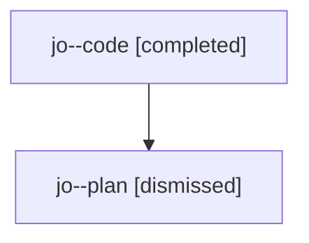

# Family: jo

Owner: `bbugyi200.athena` · Hood: `jo` · Members: 2

## Lineage

The diagram is an optional enhancement; the ordered table below contains the same lineage in accessible text.

| Role | Agent | State | Model / provider | Timing | Commits | Prompt | Chat |
|---|---|---|---|---|---:|---|---|
| code | jo--code | completed | gpt-5.6-sol / codex | 2026-07-24T21:15:19.613714+00:00 | 1 | — | [Chat](../agents/bbugyi200.athena.jo--code/chat.md) |
| plan | jo--plan | dismissed | opus / claude | 2026-07-24T17:00:43.341822 → 2026-07-24T18:18:33.743008 | 0 | — | [Chat](../agents/bbugyi200.athena.jo--plan/chat.md) |
