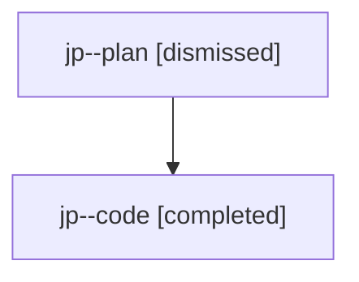

# Family: jp

Owner: `bbugyi200.athena` · Hood: `jp` · Members: 2

## Lineage

The diagram is an optional enhancement; the ordered table below contains the same lineage in accessible text.

| Role | Agent | State | Model / provider | Timing | Commits | Prompt | Chat |
|---|---|---|---|---|---:|---|---|
| plan | jp--plan | dismissed | gpt-5.6-sol / codex | 2026-07-24T17:53:00.977526 → 2026-07-24T18:46:51.685608 | 0 | — | [Chat](../agents/bbugyi200.athena.jp--plan/chat.md) |
| code | jp--code | completed | gpt-5.6-sol / codex | 2026-07-24T21:59:21.315653+00:00 | 1 | — | [Chat](../agents/bbugyi200.athena.jp--code/chat.md) |
